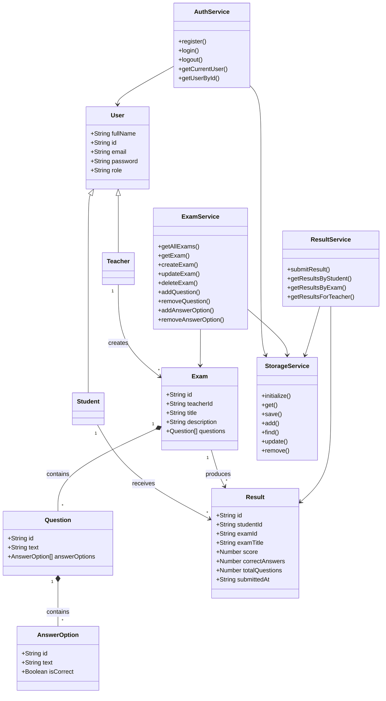

````md
# Online Examination System

## Live Website

GitHub Pages:

```text
<insert-github-pages-address-here>
```

---

## Overview

This project depicts a simple rendition of a grading system, accessible by both faculty and students.  
Each user engages with an interface based on their own user type.

---

## Features

- User registration and login
- Teacher and student roles
- Exam creation and management
- Multiple-choice questions
- Automatic grading
- Student results
- Teacher results overview
- Local storage persistence

---

# Project Structure

```text
Web_dev_final/
│
├── css/
│   └── style.css
│
├── pages/
│   ├── register.html
│   ├── login.html
│   ├── teacher-dashboard.html
│   ├── student-dashboard.html
│   ├── exam-details.html
│   ├── take-exam.html
│   └── results.html
│
├── js/
│   ├── controllers/
│   ├── models/
│   ├── services/
│   ├── utils/
│   └── main.js
│
├── index.html
└── README.md
```

---

# Architecture

The architecture is relatively simple and follows the pipeline below.  
The responsibilities of each section are described in their respective sections.

```text
HTML Page
     │
     ▼
Controller
     │
     ▼
Service
     │
     ▼
StorageService
     │
     ▼
localStorage
```

---

# UML Class Diagram

The following diagram presents the main models and services used by the application.



---

# Modules

## Models

Models are the basic data structures and classes of the program.  
In this project, models mainly contain data and represent the entities used by the application.

- User
- Teacher
- Student
- Exam
- Question
- AnswerOption
- Result

---

## Controllers

Controllers form the page logic layer of the application.  
Each controller is responsible for reading page data, registering event listeners, calling services, and updating the user interface.

- registerController
- loginController
- teacherDashboardController
- studentDashboardController
- examDetailsController
- takeExamController
- resultsController

---

## Services

Services contain the application's business logic.

`AuthService`, `ExamService`, and `ResultService` manage operations related to their respective entities.  
`StorageService` is the only service that communicates directly with the browser's `localStorage`.

- AuthService
- ExamService
- ResultService
- StorageService

---

## Utilities

The utilities section contains shared constants and general-purpose data used by different parts of the project.  
The main goal is to maintain consistency throughout the application.

- storageKeys

---

# User Roles

## Teacher

- Create exams
- Edit exams
- Delete exams
- Manage questions
- Manage answer options
- View student results

## Student

- Register and log in
- Browse available exams
- Take exams
- View personal results

---

# Technologies

- HTML5
- CSS3
- JavaScript
- ES6 Modules
- LocalStorage
- Mermaid UML diagrams

---

# Installation

This project does not require any external dependencies or a build process.  
It is a client-side web application that runs entirely in the browser using JavaScript modules and the browser's Local Storage.

1. Clone the repository.

```bash
git clone <repository-url>
```

2. Open the project folder.

3. Launch the project using **Live Server** or another local web server.

4. Open the generated URL in your browser.

---

# Application Flow

The application provides two different workflows depending on the authenticated user's role.

## Teacher

```text
Login
   ↓
Teacher Dashboard
   ↓
Create / Manage Exams
   ↓
Student Takes Exam
   ↓
View Results
```

Teachers are responsible for creating and maintaining examinations.  
They can add questions, define the correct answers, edit existing exams, and review results submitted by students.

## Student

```text
Login
   ↓
Student Dashboard
   ↓
Choose Exam
   ↓
Take Exam
   ↓
Submit
   ↓
View Results
```

Students can browse available examinations, complete them, receive an automatic grade upon submission, and review their previous results.

---

# Data Storage

The application stores all information using the browser's `localStorage`.

Collections include:

- Users
- Exams
- Results
- Current User

---

# Validation

The application includes several validation rules, including:

- Required field validation
- Duplicate email prevention
- Duplicate ID prevention
- User authentication
- Role validation
- Exam existence validation
- Question existence validation
- Answer option validation

---

# Future Improvements

Possible future improvements include:

- Edit existing questions
- Edit existing answer options
- Timer for exams
- Exam search and filtering
- Exam statistics
- Average score calculation
- Question randomization
- Additional responsive design improvements

---

# Authors

- **Name:** Navot Saggi
- **Student ID:** 208745083
````
